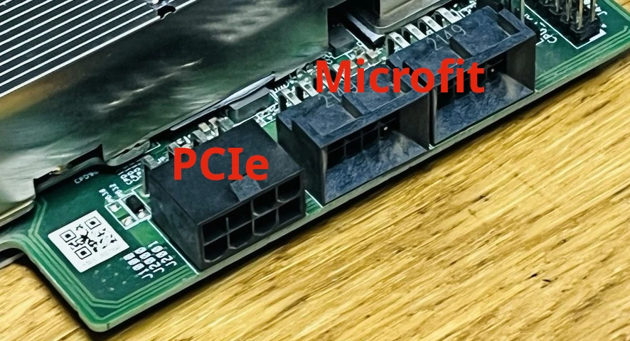
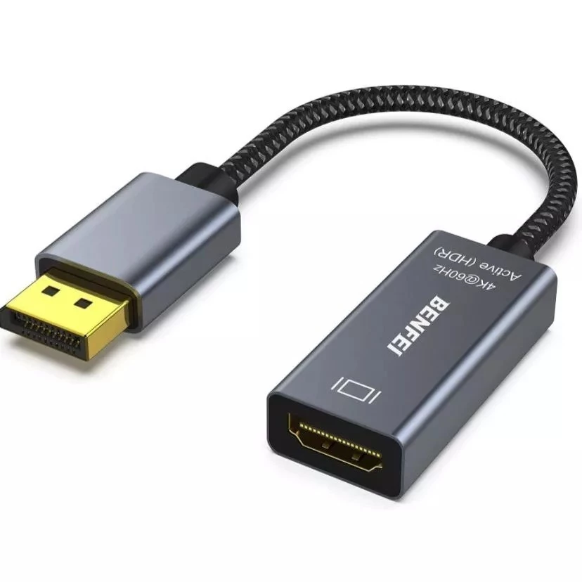
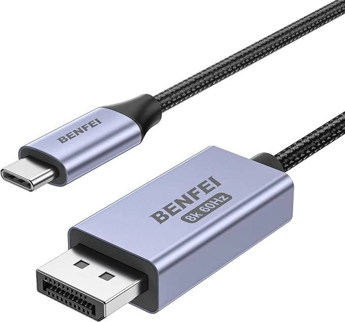

## Sobre
Este documento se propõe a ser uma curadoria não exaustiva de informações sobre a placa AsRock BC-250 e a gama infinita de possibilidades que a acompanham.

## O que é a placa AsRock BC-250

A AMD BC250 é um hardware compacto construído em torno da APU 'Cyan Skillfish' da AMD que é, diz a lenda, a mesma usada no console Playstation 5 da Sony com algumas funções restringidas.  
  
Originalmente esse hardware foi projetado para ser usado em rigs de mineração de criptomoedas.  
  
  
  
    
  
    
  
A função inicial deixou de ser interessante e foi quando os rigs foram desmontados e essas placas começaram a ser vendidas como "e-waste".  
Sorte da comunidade 😀😀
  
Logo a turma a descobriu novas possibilidades de uso, como capacidade para gaming, desktop com excelente custo benefício e em alguns cenários de IA.  

**OBS.: Até o momento não existem drivers de aceleração gráfica para o windows.**

## Características básicas do Hardware  
  
Como mencionado anteriormente, a AsRock BC-250 vem de fábrica com algumas funcionalidades restritas, isso se deve ao fato de ela ter sido projetada exclusivamente para a mineração de criptomoedas e construída a partir de chips que foram rejeitados pela linha de produção principal.  
  
Dito isso, segue uma tabela com as configurações de fábrica e o que talvez seja possível atingir (Loteria do silício).
  
| Característica | Default | Possibilidade |
|  :--- |  :---: |  :---: |
| CPU | 6C/12T | 8C/16T |
| CPU Clock | 3500 MHz | 4000 MHZ |
| GPU | 28 CUs | 40 CUs |
| GPU Clock | 1500 MHz | 2230 MHz |
| Memória  | *16GB GDDR6 | N/A |
| Saída de Video  | 1x DisplayPort | N/A |
| Rede  | 1x GbE Ethernet | N/A |
| Armazenamento  | 1x stlot M.2 NVMe/SATA (gen2) | N/A |
| USB  | 2x USB 3.0, 2x USB 2.0 | N/A |
| USB  | 2x USB 3.0, 2x USB 2.0 | N/A |
  
*A memória é compartilhada entre CPU e GPU  
  
## O básico para começar  
Uma vez que já fomos apresentados a BC-250 vamos a uma lista básica do mínimo necessário para começar a se divertir:  
  
- Uma placa AsRock BC-250 🙄
- Uma fonte ATX com um conector PCIe que consiga sustentar no mínimo 300W na linha de 12v.  
- Cabo DisplayPort para uso com um monitor com essa conexão, ou adaptador DisplayPort para HDMI para uso com monitor HDMI ou TV.  
- Armazenamento (algumas possibilidades):   
  - Preferencialmente uma memória M.2 NVMe com capacidade para sistema operacional, aplicativos e jogos, lembrando que o slot é M.2 gen 2, por isso, não precisa investir em midias rápidas como gen3, gen4 ou mesmo gen5.    
  - Algum tipo de armazenamento USB (disco externo)  
  - Adaptador conversor de M.2 para SATA (chip testado pela comunidade ASM1166)  
- Um apatador USB Wifi/Bluetooth se você não for usar rede ethernet e se precisar de conexão bluetooth.
- Duas FANs de 120mm, uma para o dissipador principal e outra para o backplate das memórias
- Paciência e curiosidade  
  
> [!TIP]  
> Ao final existem algumas dicas para o além do básico, como PTM 7950, thermalpads, cases e dissipador para o backplate.  
  
## Cuidados com as compras

### Como saber se a fonte é suficiente  
A alimentação principal da BC-250 acontece via um conector PCIe de 8 pinos, presente na maior parte das fontes ATX e são comumente usados para alimentar placas de video, além do PCIe a alimentação pode ser complementada ou substituída por uma alimentação através de dois plugues do tipo microfit que ficam ao lado, ressaltando que eles tem uma pinagem específica e não padrão.  
  
    
  
Ainda não existe um consenso sobre a importância do uso dos conectores microfit, embora seja difícil refutar o argumento de "quanto mais melhor", a prática não evidencia ganhos em uso padrão, mesmo em situações de overclock.  
  
A documentação sugere no mínimo que a linha de 12V da fonte a ser usada entregue 300W, para saber isso, basta olhar a especificação da fonte e verificar a corrente que o 12V consegue entregar.  
  
Ex. Uma fonte relativamente popular é a MSI MAG A500DN, fonte de 500W, em um primeiro momento podemos nos enganar olhando para "número" da fonte, 500W é mais que suficiente, não é?  
  
Esse pensamento é enganoso, pois examinando a especificação da linha de 12V veremos que o máximo de corrente entregue é de 21A e o cálculo da potência é **P = V × I (Potência (P) = Voltagem (V) x Corrente (I))** nessa caso em questão temos "somente" uma entrega de **252W**, isso em momentos de pico, portanto essa fonte de 500W não seria o recomendado.  
  
> [!TIP]  
> Formula para saber a potência P = V × I (Potência (P) = Voltagem (V) x Corrente (I))
  
Lembrando que estamos discutindo o mínimo para se iniciar com a BC-250, mas se a ideia é criar um setup compacto, usando cases personalizados e pequenos, sempre teremos as fontes flex, como por exemplo as fontes flex modulares da metalfish.  
*Obs.: Até um passado bem recente as fontes metalfish de 600W tinha uma imcompatibilidade com a BC-250, mas isso foi resolvido recentemente, como fica explícito na página deles no aliexpress.  
  
### Adaptador/Cabo DisplayPort para HDMI
Existe um momento canônico muito comum entre os proprietários da BC-250 que é a primeira vez que a placa é ligada e que apesar dos leds acenderem ela não dá video, usando uma amostra puramente anedótica, vemos que a maior parte desses casos é resultado da combinação adaptador/cabo versus monitor/tv, pois a BC-250 é muito "seletiva" e não funciona em qualquer cenário. No meu caso eu uso um adaptador da ugreen que funciona com a minha TV, mas não funciona no meu monitor principal, quando eu quero usar esse monitor, uso um cabo DisplayPort puro, outra situação é quando eu quero conectar a BC-250 no meu monitor portátil da Arzopa e uso um cabo DisplayPort para USB-C.
Seguem as especificações do que é sugerido pela comunidade:  

[Adaptador BENFEI DP para HDMI](https://shopee.com.br/product/1590082224/58250184593?gads_t_sig=gqRjZGVrxHCFomtpsTE0MjUxOnRzc19zZGtfa2V5omt20QACpGFsZ2_SAAAAZKNkZWvAomN0xEAAAAAMaaRlZwa4TmRr35EbRKe45opqqWzquDpxLoPl6a_nP90XlrFndAmj-Eti4LViLnnfxaArnW_92wfHWioVqmNpcGhlcnRleHTEdAAAAAzEdJYIlMyBP-5Pmi-aI8ubtR5HcX38fiWtkN0vaYOYLnESM_VBDtr98r5gwfpsE0-hbf1YQ-V5bGKEQXbvn23nlJ3ZLJr6ijfx9nnHC_vCDwWsV0kh57eImjsIBCgDTFR4ADieeHLvphDhEpgdM8jM&gad_source=1&gad_campaignid=20824904870&gclid=Cj0KCQjwhsrUBhDxARIsAN3AQSeJlDutKoEcqnicEc_ep5yhbQ81NhSkNAjzG2RkGktTB0pcOz1_ISEaAosYEALw_wcB)  
   
[BENFEI — Cabo USB C para DisplayPort 1.4 bidirecional](https://www.amazon.com.br/dp/B0DNSNGDSB?ref=ppx_yo2ov_dt_b_fed_asin_title)  
 
    
### Adaptador USB para WIFI/Bluetooth
Nesse caso a "incompatibilidade" se dá por conta de alguns chipsets que não são compatíveis com linux, além disso, existe o comportamento de alguns fabricantes/lojas que entregam o mesmo "modelo" de dispositivo com chipsets diferentes, por isso a melhor forma é procurar no anúncio se é compatível com linux, sendo que a forma mais garantida é procurar no anúncio o modelo do chipset e pesquisar no google a compatibilidade com linux.  

Ex. [Adaptador USB Sem Fio Wifi/Bluetooth 600Mbps](https://s.click.aliexpress.com/e/_mOyWwIX) se seguirmos o link e olharmos a especificação teremos o chipset **RTL8812** e se jogarmos no google **linux RTL8812 kernel 7** a resposta virá dizendo que o driver para o adaptador RTL8812 é nativamente suportado no kernel 7.X. Obs.: Em distros que usem kernels mais antigos pode ser necessário instalar o driver DKMS específico.

### FANs/Ventoinhas  
Novamente, reforçando, esse guia é o mínimo necessário para começar, existem alternativas mais avançadas e caras que não serão descritas aqui, como por exemplo o uso de Water Cooler.  
  
O consenso da comunidade é que uma FAN 120mm Arctic Cooler 12P Pro no dissipador original (com as aletas abertas) e um atrás no backplate é suficiente para a maioria dos casos, mesmo em situações de overclock.  
  
Caso esse modelo esteja em falta as especificações que devem ser buscadas na alternativa, são:  
  
- Conector PWM (Consegue associar o RPM com a temperatura dos componentes)   
- RPM. O Arctic Cooler atinge 3000 RPMs máximos.  
- Pressão estática. Para referência, o Arctic Cooler tem uma pressão estática de 6.9 mmH2O, que no caso de uma BC-250 com as aletas abertas é a pressão que ele consegue jogar o ar para dentro do dissipador.  
- Nível de ruído (Opcional)

## Características da instalação
Como resultado final da instalação teremos um Arch Linux com as seguintes características:  
  
- Arch-Linux com kernel zen ou o específico para a BC-250.
- Desktop Enviromento: KDE/Plasma
- Alguns utilitários e aplicativos: Firefox, VLC, btop e yt-dl dentre outros.  
- Sistema de arquivos: BTRFS
- Bootloader: Limine
- Arquivo de SWAP com ZSWAP  
  
## Acesso rápido aos scripts

```
curl -s "https://raw.githubusercontent.com/renatas1m03s/Arch-BC250/refs/heads/main/prepare.sh" | sh && cd /root/Arch-BC250 && ls -la
```
  
Descrição das ações do script acima:  
    
- Atualiza as chaves PGP de assinatura dos pacotes do Arch Linux.  
- Instalação das ferramentas **"git"** e **"p7zip"**  
- Baixa os scripts via git clone na pasta **"/root/Arch-BC250"**  
- Vai para a pasta /root/Arch-BC250 e lista seu conteúdo  

> [!TIP]  
> Alternativamente aos passos automatizados acima é possível fazer manualmente da seguinte forma:  
  
1. Instala o **"git"** 
```
pacman -Sy --noconfirm git
```  

2. Faz o download dos scripts  
```
git clone https://github.com/renatas1m03s/Arch-BC250 /root/Arch-BC250
```


## Etapas da instalação  
  
1. [Configuração de disco](#configuração-de-disco)
2. [Ajustes no pacman](#ajustes-no-pacman)
3. [Instalação do sistema](#instalação-do-sistema)
4. [Configuração do bootloader](#configuração-do-bootloader)
5. [Configuração do usuário](#configuração-do-usuário)
6. [Scripts adicionais](#scripts-adicionais)

> [!TIP]  
> Os scripts estão numerado e devem ser executados em ordem.  
  
## Configuração de disco  
Essa etapa pode ser feita automaticamente através da execução do script ou pode ser feita manualmente.

O resultado da execução do script é:  
  
- Uma partição de **4096MiB/4GiB**, formatada com **FAT32** e montada em /mnt/boot.
- Uma partição com o restante da área do disco, formatada como **BTRFS**.
- Os seguintes subvolumes do BTRFS:  
  - @      - Montado como /mnt (root)  
  - @home  - Montado como /mnt/home  
  - @root  - Montado como /mnt/root  
  - @cache - Montado como /mnt/var/cache  
  - @log   - Montado como /mnt/var/log  
  - @tmp   - Montado como /mnt/var/tmp  
  - @Data  - Montado como /mnt/mnt/Data  
  - swap   - Montado como /mnt/swap  
- Um arquivo de swap em /mnt/swap/swapfile de **8GB**  
  
Caso se deseje usar uma configuração diferente, basta respeitar três condições:  
  
1. Partição FAT32 como ESP e montada em /mnt/boot   
2. Estrutura do root "/" montada em /mnt  
3. Swap configurado como arquivo para tirar proveito do ZSWAP  
    
O script em questão é o **"1-wipe-disk.sh"** e ele recebe como parâmetro o disco onde o arch será instalado.  
  
Use o seguinte comando para identificar o disco onde se pretende realizar a instalação:

> **fdisk -l**

Supondo do que disco seja um NVME identificado como **"/dev/nvme0n1"** a execução do script seria:  
  
> **./1-wipe-disk.sh /dev/nvme0n1**  

> [!IMPORTANT]  
> Esse script formata/apaga todos os dados do disco escolhido  
    
## Ajustes no pacman
O script **"2-set-pacman.sh"** faz alguns ajustes no arquivo **"pacman.conf"**, são eles:  
- Habilitar a multilib do arch, que é a biblioteca 32bits (necessária para a steam).  
- Habilitar o respositório para o kernel customizado para a BC250. Isso não tem efeito colateral algum em PCs diferentes da BC250.  
- Habilitar algumas itens cosméticos, como por exemplo o download paralelo em 8 filas. 

Além desses ajustes o script executa o utilitário **"reflector"** que atualiza a lista de mirrors e classifica por taxa de download.   
  
> Modo de uso:

> **./2-set-pacman.sh**  
   
## Instalação do sistema
Existem dois scripts o **"3-base-system-bc250.sh"** e o **"3-base-system.sh"** que mudam entre si somente o kernel que eles entregam, ambos executam as seguintes atividades:  
  
1. Criam a estrutura de pastas de sistema do Arch Linux.  
2. Geram o arquivo **"fstab"**  
3. Definem as configurações regionais e o hostname (Defaults: br-abnt2, America/Sao_Paulo e just4play como hostname)  
4. Instalam os arquivos base do Arch Linux, bliblioteca mesa, plasma/kde e alguns utilitários.  
5. Habilitam alguns serviços básicos (NetworkManager, sshd, plasmalogin, avahi-daemon e bluetooth)  
  
Os kernels entregues são **"linux-cachyos-bc250"** e **"linux-zen"**, respectivamente.
    
> Modo de uso: ./3-base-system.sh \[opções\]  
> Opções:  
>   -k, --keyboard VALOR&nbsp;&nbsp;&nbsp;&nbsp;# Keyboard - default br-abnt2      
>   -t, --timezone VALOR&nbsp;&nbsp;&nbsp;&nbsp;# Timezone - default America/Sao_Paulo     
>   -s, --system&nbsp;&nbsp;&nbsp;&nbsp;&nbsp;&nbsp;&nbsp;&nbsp;&nbsp;&nbsp;&nbsp;&nbsp;&nbsp;&nbsp;&nbsp;&nbsp;&nbsp;&nbsp;&nbsp;# Hostname - default just4play    
>   -h, --hel&nbsp;&nbsp;&nbsp;&nbsp;&nbsp;&nbsp;&nbsp;&nbsp;&nbsp;&nbsp;&nbsp;&nbsp;&nbsp;&nbsp;&nbsp;&nbsp;&nbsp;&nbsp;&nbsp;&nbsp;&nbsp;&nbsp;&nbsp;&nbsp;&nbsp;# Display this help message  
  
> Ex.:  
> **./3-base-system-bc250.sh -k us-acentos -t America/Fortaleza -s linuxtest**  

> [!TIP]  
> Os parâmetros são opcionais e independentes, você pode alterar qualquer um deles individualmente.
  
Se não for passado qualquer parâmetro o default é teclado **"br-abnt2"**, timezone **"America/Sao_Paulo"** e hostname **"just4play"**
Esse script instala o sistema operacional, com o kernel personalizado para a BC-250, além da interface gráfica.  
  
## Configuração do bootloader
O bootloader usado nesse conjunto de scripts é o limine, essa escolha é para manter a aderência com alguns scripts feitos para o CachyOS, que são largamente utilizados na comunidade entusiasta da BC-250.  
  
A execução é simples e o único parâmetro é o disco do sistema (tal como o script de configuração de disco).  

Use o seguinte comando para identificar o disco onde se pretende realizar a instalação:

> **fdisk -l**

Supondo do que disco seja um NVME identificado como **"/dev/nvme0n1"** a execução do script seria:  
  
> **./4-set-limine.sh /dev/nvme0n1**  
  
## Configuração do usuário
O script **"5-set-user.sh"** se executado sem qualquer parâmetro entrega:  
  
  - Um usuário chamado **"arch"**, com a descrição **"Arch User"**;  
  - Usuário **"root"** e **"arch"** com a mesma senha **"archlinux"**;  
  
Para alterar qualquer um dessas opções, podemos passá-los como parâmetros:  

> Modo de uso: ./5-set-user.sh [opções]  
> Opções:  
> -u, --user VALOR&nbsp;&nbsp;&nbsp;&nbsp;&nbsp;&nbsp;&nbsp;&nbsp;# Username - default arch  
> -c, --displayname VALOR # Nome completo - default Arch Linux  
> -p, --password VALOR&nbsp;&nbsp;&nbsp;&nbsp;# Password - default archlinux  
> -h, --help&nbsp;&nbsp;&nbsp;&nbsp;&nbsp;&nbsp;&nbsp;&nbsp;&nbsp;&nbsp;&nbsp;&nbsp;&nbsp;&nbsp;# Display this help message  
  
> Ex.:  
> **./5-set-user.sh -u palmeiras -c 'Palestra Itália' -p 'P@ssw0rd'**  
  
Além da configuração dos usuários, esse script entrega:  
  
  - Usuário com privilégio de sudo  
  - Arquivo de configuração do Alacritty já na pasta do usuário  
  - KDE/Plasma configurado em inglês, mas com unidades, métricas e parâmetros regionais em **"pt-BR"**
  - Instala um pacote de ícones [Tela-icon-theme](https://github.com/vinceliuice/Tela-icon-theme)
  - Alguns wallpapers do Arch copiados para a pasta **"~/Pictures"**
  - Copia todos esses scripts para a pasta **"~/Arch-BC250"**  
  
## Scripts adicionais
Como dito logo acima, a pasta que foi feito o download do github **"Arch-BC250"** é copiada para o **"~/"** (home do usuário).  
Dentro dessa pasta temos uma outra **"~/Arch-BC250/scripts"** que contém três deles a serem executados após o login no KDE/Plasma, são eles:  
  
  - **"yay.sh"** que faz a instalação do gerenciador de pacotes do AUR.  
```
~/Arch-BC250/scripts/yay.sh  
```  
  
  - **"config-limine.sh"** que termina de fazer a configuração limine e integra aos snapshots do BTRFS.  
```  
sudo ~/Arch-BC250/scripts/config-limine.sh
```
  
  - **"gaming-setup.sh"** Instala a **"Steam"**, **"retroarch"** e o **"ES-DE"**, além do modo gaming no login.  
```
~/Arch-BC250/scripts/gaming-setup.sh
```
